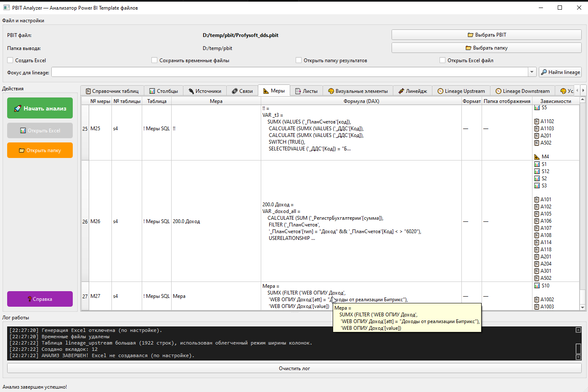

# PBIT Analyzer

Desktop-приложение для анализа `Power BI Template` (`.pbit`) файлов.



## Что делает

- распаковывает `.pbit` и читает `DataModelSchema` + `Layout`;
- извлекает таблицы, столбцы, меры, связи, источники;
- анализирует листы, визуалы и условное форматирование;
- показывает данные во вкладках GUI;
- опционально формирует Excel-отчет (по галке `Создать Excel`);
- строит lineage (общий и фокусный для выбранного элемента).

## GUI: ключевые возможности

- все чекбоксы по умолчанию выключены;
- чекбокс `Создать Excel` управляет созданием `.xlsx`;
- чекбокс `Открыть Excel файл` работает только если Excel был создан;
- поле `Фокус для lineage` активно после завершения анализа;
- `Фокус для lineage` — выпадающий список с автодополнением и ручным вводом;
- кнопка `Найти lineage` пересчитывает `Lineage Upstream/Downstream` только для выбранного фокуса.

## Формат ссылок и ID

- ссылки на таблицы: `📊 S...` (например, `📊 S4`);
- ссылки на столбцы: `📋 A...` (например, `📋 A601`);
- ссылки на меры: `📐 M...` (например, `📐 M22`);
- ID визуала: `VIS_ID :<id>` (например, `VIS_ID :f48726d8e921d4f3f01f`).

## Формат элементов в "Фокус для lineage"

- общий формат: `Тип элемента | ID | Название`;
- для визуалов: `Тип элемента | ID | Тип визуала`;
- названия подтягиваются из соответствующих вкладок:
  - `Таблица` -> `Справочник таблиц`;
  - `Столбец` -> `Столбцы`;
  - `Мера` -> `Меры`;
  - `Визуал` -> `Визуальные элементы` (тип визуала).

## Требования

- Python 3.10+
- Windows (основной сценарий использования)

## Установка

```bash
python -m pip install -r requirements.txt
```

## Запуск

Через bat-файл:

```bash
tasks.bat
```
```
откроется окно для выбора
==========================================
            PBIT Analyzer Tasks
==========================================
1. Run GUI application
   Starts: python _work\last_work_gui_work.py
2. Lint code
   Runs:   python -m ruff check .
3. Run tests
   Runs:   python -m pytest
4. Check all (lint + test)
   Runs lint first, then tests
5. Exit

CHOICE=Enter option number [1-5]: 
```


Или напрямую:

```bash
python _work\last_work_gui_work.py
```

Примечание: авто-установка недостающих библиотек

## Структура

- `_work/last_work_gui_work.py` — точка входа GUI.
- `_work/pbi_modules/gui.py` — интерфейс и фоновый worker.
- `_work/pbi_modules/analyzer.py` — сервис анализа `.pbit` (оркестрация).
- `_work/pbi_modules/extractors.py` — извлечение из `DataModelSchema` и `Layout`.
- `_work/pbi_modules/excel_report.py` — генерация Excel.
